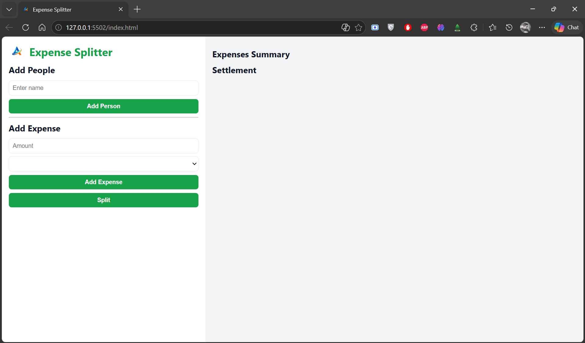

# Expense Splitter

## Overview
This is one of my initial projects built to understand how to handle user input, basic calculations, and DOM manipulation using JavaScript.

The application allows users to add people, record expenses, and split the total amount among participants.

## Features
- Add multiple people
- Add expenses dynamically
- Split total expense equally
- Simple and clean UI for easy usage

## Tech Stack
- HTML
- CSS
- JavaScript

## What I Learned
- Handling user input fields
- Basic DOM manipulation
- Event handling in JavaScript
- Structuring a simple UI layout

## How to Run
1. Download or clone this repository
2. Open `index.html` in your browser

## Project Level
Beginner

## Screenshort

## Note on Logo Usage
The logo used in this project is my personal brand identity.  
It is included only for demonstration purposes and should not be reused, redistributed, or used in other projects without permission.

## Growth Note
This project marks the beginning of my journey into frontend development, where I started understanding how user input interacts with JavaScript logic.
